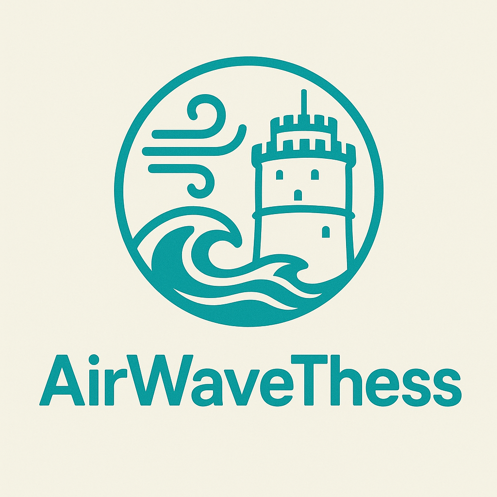

# AirWave Thess




**AirWaveThess** is a climate-focused application created for the [OpenUP Hackathon Thessaloniki Climate 2025](https://openup.okfn.gr/) by [Konstantinos Petrakis](https://www.linkedin.com/in/konpetrakis/) and [Kyriaki Pantsiopoulou](https://www.linkedin.com/in/kiriaki-pantsiopoulou-a701b0215/). The project processes and visualizes available air quality and sea water quality data, aiming to provide insights into environmental conditions of Thessaloniki. It was developed using TypeScript, React, Python, and FastAPI.

## Installation

Normally the installation includes a LLM via Ollama, but if you don't have a decent nvidia GPU with at least 8GB VRAM (would suggest 3060 or better) you can skip the LLM part and just use the frontend and backend services.

Whatever installation method you choose, first clone the repository and navigate to the project root directory:

```bash
git clone https://github.com/KonstantinosPetrakis/airwave-thess.git
cd airwave-thess
```

### Installation with LLM

```bash
cp ./frontend/.env.production.example ./frontend/.env.production
cp ./frontend/.env.development.example ./frontend/.env.development
cp ./backend/.env.production.example ./backend/.env
docker compose up
# Visit localhost
```

### Installation without LLM

```bash
cp ./frontend/.env.production.example ./frontend/.env.production
cp ./frontend/.env.development.example ./frontend/.env.development
cp ./backend/.env.production.example ./backend/.env
docker compose up frontend fastapi web_server
# Visit localhost
```

## Installation for Development (without Docker)

### Frontend

```bash
cd frontend
cp .env.development.example .env.development
cp .env.production.example .env.production
npm install
npm run dev
```

### Backend

```bash
cd backend
cp .env.development.example .env
python -m venv venv
source venv/bin/activate  # On Windows use `venv\Scripts\activate`
pip install -r requirements.txt
fastapi dev main.py
```

### LLM via Ollama (optional)

```bash
# Install Ollama from https://ollama.com/download
# You can use any model you like that supports tool calling, if you also change the main.py `MODEL_NAME` variable
ollama run qwen3:8b
```

### If you want to preprocess the original data via the `data.py` module (and not rely on the already processed data in the `backend/data` folder):

First download the original data from the Releases and unzip it inside the `backend/data` folder.
Then run the following command from the project root directory:

```bash
python -m backend.data
```
